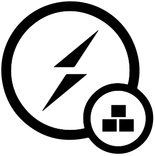

<p align="center">
  
</p>
<h2 align="center">Socket.io-ease</h2>

## Description

Socket.io-ease is a library that provides an abstraction layer on top of socket.io, integrating concepts from other popular libraries such as express.js and adonis.js. It aims to simplify the development of socket.io-based projects by providing a straightforward and well-organized structure.

## Installation

To install Socket.io-ease, use either npm or yarn:

#### npm:

```
npm install socket.io-ease
```

#### yarn:

```
yarn add socket.io-ease
```

## Usability

Once Socket.io-ease is installed, you can create a `SocketServer` instance by providing a server object or a port number as a parameter as a [socket.io](https://github.com/socketio/socket.io#module-syntax). Here's an example:

```ts
import { SocketServer } from "socket.io-ease";
import server from "src/server"

/*The server can be from any framework or library 
(express, koa, fastity, adoniss.js) or simply standalone*/
const socketServer = new SocketServer(server);
```

You can then add listeners to the server by providing event names and controller functions. Here's an example:

```ts
import { SocketServer } from "socket.io-ease";
import server from "src/server";
import controller from "src/controller";

const socketServer = new SocketServer(server);
socketServer.addListener("example", controller); // listen in "/example" event
socketServer.connection();
```

You can group listeners by using a callback that takes a `SocketNode` object as a parameter. Here's an example:

```ts
import { SocketServer, SocketNode } from "socket.io-ease";
import server from "src/server";
import controller from "src/controller";

const exampleGroup = (node: SocketNode) => {
  node.addListener("example", controller)
}

const socketServer = new SocketServer(server);
socketServer.addGroup(exampleGroup)
socketServer.connection();
```

You can also add a prefix to a group of listeners by providing it as an option. Here's an example:

```ts
import { SocketServer, SocketNode } from "socket.io-ease";
import server from "src/server";
import controller from "src/controller";

const exampleGroup = (node: SocketNode) => {
  node.addListener("example", controller, { prefix: "foo" }) //listen in "/bee/foo/example" event
}

const socketServer = new SocketServer(server);
socketServer.addGroup(exampleGroup, { prefix: "bee" })
socketServer.connection();
```

You can use middleware functions to handle incoming requests for a group of listeners as [express](https://expressjs.com/es/guide/using-middleware.html) or [adonis](https://docs.adonisjs.com/guides/middleware). Here's an example:

```ts
import { SocketServer, SocketMiddleware, SocketConnection, SocketNext, SocketRequest } from "socket.io-ease";
import server from "src/server";
import controller from "src/controller";

class Middleware implements SocketMiddleware {
  handler: (request: SocketRequest, connection: SocketConnection, next: SocketNext) => {
    //some logic
    next()
  };
}

const exampleGroup = (node: SocketNode) => {
  node.addListener("example", controller, { middlewares: [Middleware] })
}

const socketServer = new SocketServer(server);
socketServer.addGroup(exampleGroup, { middlewares: [Middleware] })
socketServer.connection();
```

Finally, here's an example of a controller function that can be used as a listener:

```ts
const controller = (request: SocketRequest, connection: SocketConnection) => { 
    //logic
}
export default controller
```
